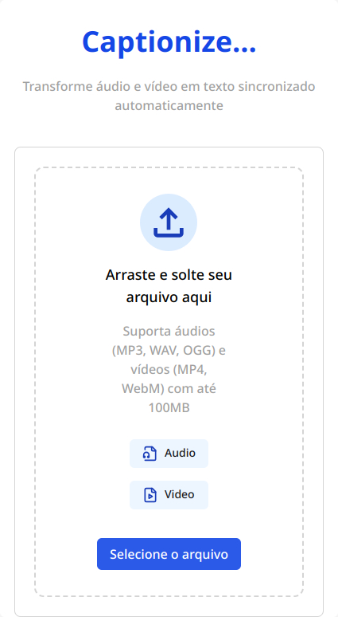
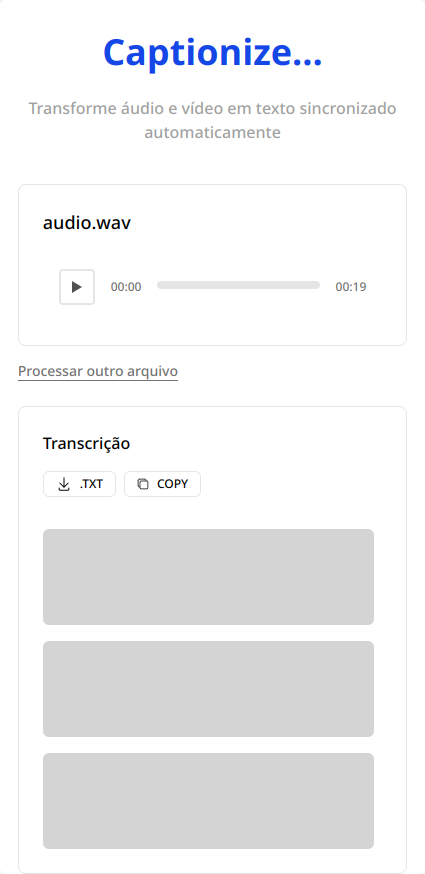
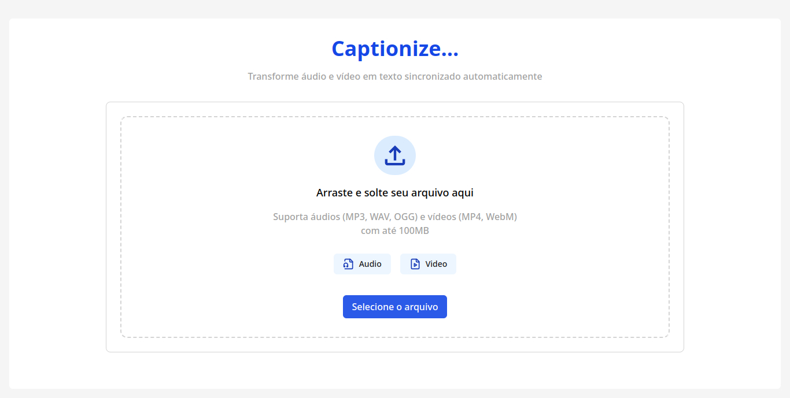
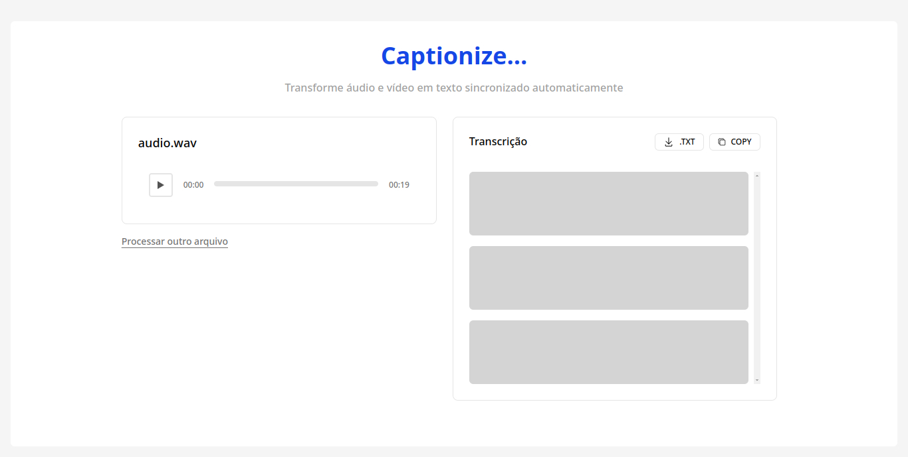

  

# Captionize | Transcrevendo audio para texto com IA

     <a target='_blanc' href="https://icarojordano.github.io/captionize/">📱 Visite o Projeto</a>

## 📝 Descrição do Projeto
Captionize é um conversor de áudio para texto, desenvolvido com foco em funcionalidade simples, processamento rápido e experiência fluida de uso. O projeto utiliza requisições à API da AssemblyAI para realizar a transcrição de arquivos de áudio, permitindo que o usuário:

- *Faça upload de arquivos de áudio*

- *Envie o áudio para a API de transcrição*
- *Visualize a transcrição automática na tela*
- *Copie ou salve o texto gerado*

O objetivo é oferecer uma solução leve e acessível para criadores de conteúdo, jornalistas, estudantes ou qualquer pessoa que precise transformar áudio em texto sem complicações. Esta é a versão MVP (Produto Mínimo Viável), ainda em desenvolvimento, mas já funcional nos principais fluxos.

## 💻 Tech Stack

<!--- # "Verify icons availability here https://github.com/tandpfun/skill-icons" -->

<h2 id="layout">🎨 Layout</h2>

    
    
    

    

## 🧩 Features

 - [X] Upload de arquivos de áudio (.mp3, .wav, .m4a etc.)
 - [X] Integração com a API da AssemblyAI para transcrição automática
 - [X] Exibição do progresso de envio e transcrição
 - [X] Visualização do texto transcrito na tela
 - [X] Copiar transcrição com um clique
 - [X] Layout responsivo (mobile-first)
 - [X] Feedback visual durante o carregamento e processamento
 - [X] Projeto leve e funcional, ideal para MVPs e testes com APIs externas

<h2 id="colab">🤝 Collaborators</h2>

Agradecimento especial a todas as pessoas que contribuíram para este projeto.

<table>
  <tr>
    <td align="center">
      <a href="#">
         
        
          <b>Icaro Jordano | Desenvolvedor 
            e Tech Manager</b>
        
      </a>
    </td>
    
  </tr>
</table>
